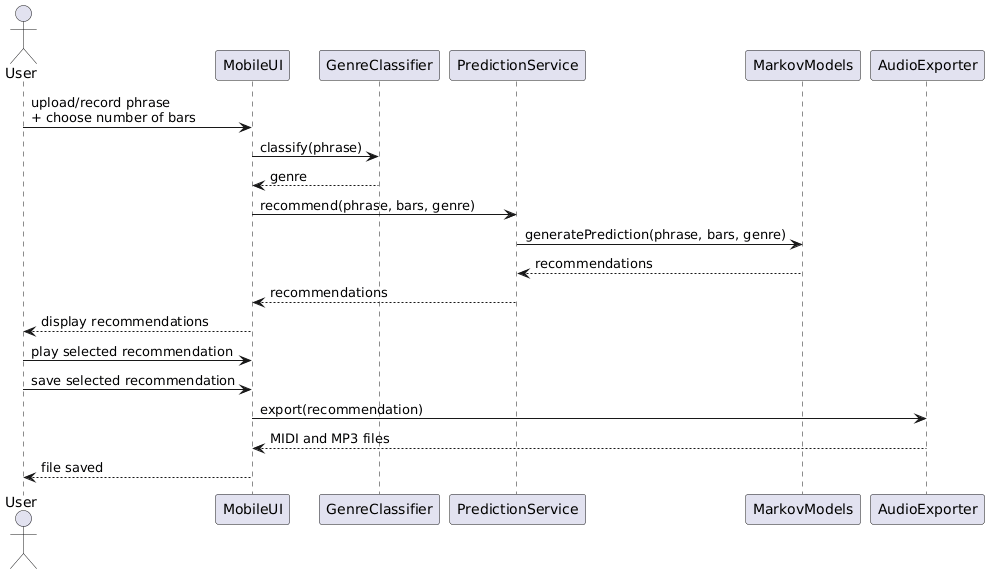

# Monophonic Musical Phrase Predictor

This project is a monophonic musical phrase predictor based on Markov models.

## Overview

The goal of this project is to build a mobile app that can analyze monophonic musical sequences and predict or generate the next notes using Markov models.

The project is developed as part of a course assignment and focuses on:
- Modeling musical sequences
- Using Markov models for prediction or generation
- Experimenting with different model parameters and representations

## Planned Features

- Input: an audio file in a supported format (MP3 for now), converted into note sequences using Spotify's Basic Pitch.
- Output: predicted or generated musical phrases as MIDI and MP3 files.
- Training using a personalized dataset
- Evaluation of prediction quality
- Mobile UI with support for audio playback and download

## UML Sequence Diagram

The following is the UML sequence diagram describing the prediction flow.
It shows the user flow from upload and input to genre classification, model
selection, prediction, and playback and export.

## Tech Stack (Planned)

- Language: Python (backend)
- Libraries: TensorFlow, Spotify's Basic Pitch
- Frameworks: React Native (frontend, mobile app UI)
- Version control: Git + GitHub

## Project Status

Work in progress. Currently in the setup and research phase.

## Team

- Ali Al-Mokdad
- Yehya Hammoud

## License

This project is licensed under the MIT License.
